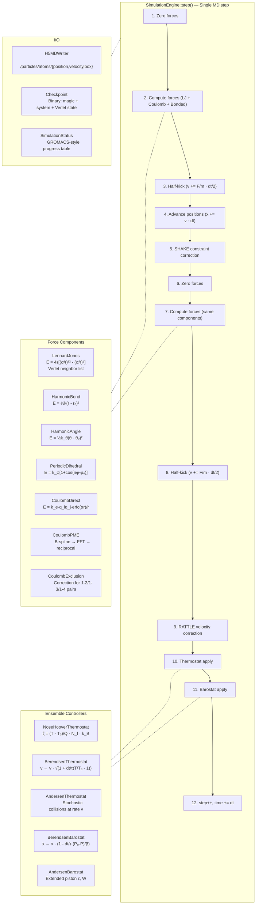
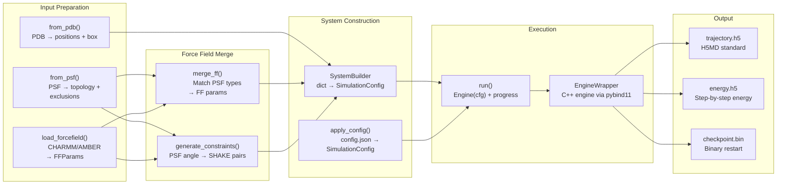

# DMD — C4 Level 3: Component Diagram

## Simulation Step Loop

## Python Data Flow

## Data Structures

| Struct | Layout | Note |
|--------|--------|------|
| **SystemData** | SoA: `pos_x/y/z`, `vel_x/y/z`, `forces_x/y/z`, `masses`, `charges`, `atom_types` | Contiguous arrays, `std::span` accessors |
| **SimulationConfig** | Flat struct: scalars + `std::vector<T>` | Populated by Python, consumed by `build_simulation()` |
| **SimulationEngine::Config** | Subset: dt, n_steps, trajectory/path settings | Used by engine at runtime |
