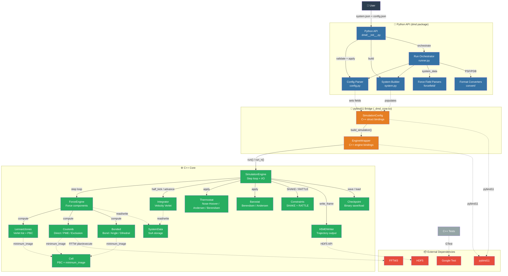

# DMD — C4 Level 2: Container Diagram

```mermaid
graph TB
    User["👤 User"]
    
    subgraph Python["🐍 Python API (dmd package)"]
        API["Python API
            dmd/__init__.py"]
        Config["Config Parser
            config.py"]
        System["System Builder
            system.py"]
        Runner["Run Orchestrator
            runner.py"]
        ForceField["Force Field Parsers
            forcefield/"]
        Convert["Format Converters
            convert/"]
    end
    
    subgraph Bridge["🔗 pybind11 Bridge (_dmd_core.so)"]
        PyConfig["SimulationConfig
            C++ struct bindings"]
        PyEngine["EngineWrapper
            C++ engine bindings"]
    end
    
    subgraph Core["⚙️ C++ Core"]
        SimEngine["SimulationEngine
            Step loop + I/O"]
        ForceEngine["ForceEngine
            Force components"]
        Integrator["Integrator
            Velocity Verlet"]
        Thermostat["Thermostat
            Nose-Hoover / Andersen / Berendsen"]
        Barostat["Barostat
            Berendsen / Andersen"]
        Constraints["Constraints
            SHAKE + RATTLE"]
        H5MD["H5MDWriter
            Trajectory output"]
        Checkpoint["Checkpoint
            Binary save/load"]
        LJ["LennardJones
            Verlet list + PBC"]
        Coulomb["Coulomb
            Direct / PME / Exclusion"]
        Bonded["Bonded
            Bond / Angle / Dihedral"]
        CellModule["Cell
            PBC + minimum_image"]
        SystemData["SystemData
            SoA storage"]
    end
    
    subgraph External["📦 External Dependencies"]
        FFTW["FFTW3"]
        HDF5["HDF5"]
        GTest["Google Test"]
        Pybind11["pybind11"]
    end
    
    User -->|"system.json + config.json"| API
    API -->|"validate + apply"| Config
    API -->|"build"| System
    API -->|"orchestrate"| Runner
    Runner --> Config
    Runner --> System
    Runner -->|"system_data"| ForceField
    Runner -->|"PSF/PDB"| Convert
    
    System -.->|"populates"| PyConfig
    Config -.->|"sets fields"| PyConfig
    
    PyConfig -->|"build_simulation()"| PyEngine
    
    PyEngine -->|"run() / run_n()"| SimEngine
    
    SimEngine -->|"step loop"| ForceEngine
    SimEngine -->|"half_kick / advance"| Integrator
    SimEngine -->|"apply"| Thermostat
    SimEngine -->|"apply"| Barostat
    SimEngine -->|"SHAKE / RATTLE"| Constraints
    SimEngine -->|"write_frame"| H5MD
    SimEngine -->|"save / load"| Checkpoint
    
    ForceEngine -->|"compute"| LJ
    ForceEngine -->|"compute"| Coulomb
    ForceEngine -->|"compute"| Bonded
    
    LJ -.->|"minimum_image"| CellModule
    Coulomb -.->|"minimum_image"| CellModule
    Bonded -.->|"minimum_image"| CellModule
    Integrator -.->|"read/write"| SystemData
    ForceEngine -.->|"read/write"| SystemData
    
    Coulomb -.->|"FFTW plan/execute"| FFTW
    H5MD -.->|"HDF5 API"| HDF5
    PyConfig -.->|"pybind11"| Pybind11
    PyEngine -.->|"pybind11"| Pybind11
    Tests["C++ Tests"] -.->|"GTest"| GTest

    classDef python fill:#3572A5,color:#fff
    classDef bridge fill:#e67e22,color:#fff
    classDef core fill:#27ae60,color:#fff
    classDef external fill:#e74c3c,color:#fff
    classDef person fill:#2c3e50,color:#fff
    classDef tests fill:#95a5a6,color:#fff

    class API,Config,System,Runner,ForceField,Convert python
    class PyConfig,PyEngine bridge
    class SimEngine,ForceEngine,Integrator,Thermostat,Barostat,Constraints core
    class H5MD,Checkpoint,LJ,Coulomb,Bonded,CellModule,SystemData core
    class FFTW,HDF5,GTest,Pybind11 external
    class User person
    class Tests tests
```
