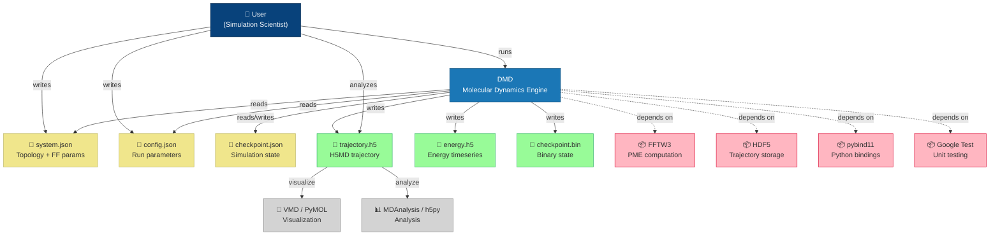

# DMD — C4 Level 1: Context Diagram

## Elementi

| Elemento | Tipo | Descrizione |
|----------|------|-------------|
| **Utente** | Persona | Scienziato che prepara input e analizza output |
| **DMD** | Sistema | Motore MD C++/Python con binding pybind11 |
| **system.json** | Input | Topologia, posizioni, parametri FF |
| **config.json** | Input | Parametri runtime (dt, ensemble, output) |
| **checkpoint.json** | Input/Output | Checkpoint testuale per restart |
| **trajectory.h5** | Output | Traiettoria in formato H5MD standard |
| **energy.h5** | Output | Serie temporale energia |
| **checkpoint.bin** | Output | Checkpoint binario bit-exact |
| **VMD/PyMOL** | Esterno | Visualizzazione traiettorie |
| **MDAnalysis/h5py** | Esterno | Analisi dati |
| **FFTW3** | Dipendenza | Trasformata di Fourier per PME |
| **HDF5** | Dipendenza | Libreria HDF5 per storage |
| **pybind11** | Dipendenza | Bridge C++/Python |
| **Google Test** | Dipendenza | Framework test C++ |
