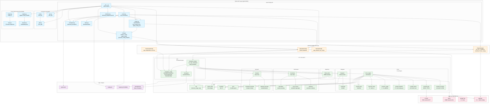

# DMD — Grafo delle Dipendenze

```mermaid
%%{init: {'theme': 'neutral', 'gitGraph': {'rotateCommitLabel': true}} }%%
graph TB
    subgraph Python["Python API Layer (python/dmd/)"]
        direction TB
        subgraph PyAPI["User-Facing API"]
            __init__["__init__.py<br/>public exports"]
            config_py["config.py<br/>validate_config, apply_config<br/>generate_config_template"]
            system_py["system.py<br/>SystemBuilder<br/>from_system_json, apply_config_json"]
            runner_py["runner.py<br/>run() orchestrator"]
            minimizer_py["minimizer.py<br/>minimize() steepest descent"]
            checkpoint_py["checkpoint.py<br/>write/read_checkpoint"]
            status_py["status.py<br/>SimulationStatus"]
        end
        subgraph PyConvert["Converters (convert/)"]
            pdb["pdb.py<br/>from_pdb"]
            psf["psf.py<br/>from_psf"]
            gro["gro.py<br/>from_gro"]
        end
        subgraph PyFF["Force Field Parsers (forcefield/)"]
            registry["registry.py<br/>register, load_forcefield"]
            base["base.py<br/>FFParams dataclass"]
            charmm["charmm.py<br/>CHARMM parser"]
            merger["merger.py<br/>merge_ff"]
        end
    end

    subgraph PyBridge["pybind11 Bridge (core.cpp)"]
        SimConfigBind["SimulationConfig<br/>Python properties"]
        EngineBind["EngineWrapper<br/>run, run_n, positions,<br/>velocities, forces, energy"]
        ThermostatBind["ThermostatConfig<br/>type, temperature, tau, freq"]
        BarostatBind["BarostatConfig<br/>type, pressure, tau, compr"]
    end

    subgraph CppCore["C++ Core (src/)"]
        direction TB
        subgraph Sim["sim/<br/>SimulationEngine"]
            sim_engine["simulation_engine<br/>run, step, checkpoint<br/>build_simulation"]
            sim_config["simulation_config<br/>SimulationConfig struct<br/>ThermostatConfig, BarostatConfig"]
            ckpt["checkpoint<br/>save/load binary"]
        end
        subgraph Force["force/<br/>ForceEngine"]
            force_engine["force_engine<br/>orchestrator"]
            lj["lennard_jones<br/>Verlet list"]
            bond["harmonic_bond<br/>E = ½k(r-r₀)²"]
            angle["harmonic_angle<br/>E = ½k_θ(θ-θ₀)²"]
            dihedral["periodic_dihedral<br/>E = k[1+cos(nφ-φ₀)]"]
            coul_direct["coulomb_direct<br/>erfc/r direct sum"]
            coul_pme["coulomb_pme<br/>SPME + FFTW"]
            coul_excl["coulomb_exclusion<br/>correction for PME"]
        end
        subgraph Integrate["integrate/"]
            integrator["integrator<br/>Velocity Verlet"]
            constraints["constraints<br/>SHAKE"]
        end
        subgraph Thermostat["thermostat/"]
            thermo_base["thermostat<br/>base class"]
            berendsen_t["berendsen<br/>velocity rescaling"]
            nose_hoover["nose_hoover<br/>extended Lagrangian"]
            andersen_t["andersen<br/>stochastic collisions"]
        end
        subgraph Barostat["barostat/"]
            baro_base["barostat<br/>base class"]
            berendsen_b["berendsen_barostat<br/>isotropic scaling"]
            andersen_b["andersen_barostat<br/>extended piston"]
        end
        subgraph Trajectory["trajectory/"]
            h5md["h5md_writer<br/>H5MD standard"]
        end
        subgraph CoreMod["core/"]
            cell["cell<br/>minimum_image, wrap"]
            sysdata["system_data<br/>SoA storage"]
            constants["constants<br/>KB, PI"]
            error["error<br/>ForceException"]
        end
    end

    subgraph ExtDeps["External Dependencies"]
        fftw["FFTW3<br/>PME reciprocal FFT"]
        hdf5["HDF5<br/>H5MD trajectory files"]
        gtest["Google Test<br/>C++ tests"]
        pybind["pybind11<br/>C++↔Python bridge"]
    end

    subgraph InputOutput["Input / Output"]
        sysjson["system.json"]
        configjson["config.json"]
        h5md_file["trajectory.h5 (H5MD)"]
        checkpoint_bin["checkpoint.bin<br/>binary checkpoint"]
    end

    %% ─── Python internal connections ───
    __init__ --> system_py
    __init__ --> runner_py
    __init__ --> config_py
    __init__ --> minimizer_py
    __init__ --> checkpoint_py
    __init__ --> pdb
    __init__ --> psf
    __init__ --> gro
    __init__ --> registry
    runner_py --> system_py
    runner_py --> checkpoint_py
    runner_py --> status_py
    runner_py --> config_py
    system_py --> config_py
    minimizer_py --> system_py
    minimizer_py --> checkpoint_py
    psf --> pdb
    registry --> charmm
    merger --> base

    %% ─── Python → Bridge ───
    __init__ --> SimConfigBind
    __init__ --> EngineBind
    config_py --> SimConfigBind
    system_py --> SimConfigBind
    runner_py --> SimConfigBind
    runner_py --> EngineBind

    %% ─── Bridge → C++ ───
    SimConfigBind --> sim_config
    EngineBind --> sim_engine
    ThermostatBind --> sim_config
    BarostatBind --> sim_config

    %% ─── C++ internal ───
    sim_engine --> sim_config
    sim_engine --> force_engine
    sim_engine --> integrator
    sim_engine --> ckpt
    sim_engine --> h5md

    force_engine --> lj
    force_engine --> bond
    force_engine --> angle
    force_engine --> dihedral
    force_engine --> coul_direct
    force_engine --> coul_pme
    force_engine --> coul_excl

    integrator --> constraints

    %% Ensemble coupling
    sim_engine --> thermo_base
    sim_engine --> baro_base
    thermo_base --> berendsen_t
    thermo_base --> nose_hoover
    thermo_base --> andersen_t
    baro_base --> berendsen_b
    baro_base --> andersen_b

    %% Core infrastructure
    force_engine --> cell
    force_engine --> sysdata
    force_engine --> constants
    force_engine --> error
    force_engine --> lj
    sim_engine --> cell
    sim_engine --> sysdata
    integrator --> cell
    h5md --> sysdata

    %% ─── External deps ───
    coul_pme --> fftw
    h5md --> hdf5
    SimConfigBind --> pybind
    EngineBind --> pybind

    %% ─── Input/Output ───
    runner_py --> sysjson
    runner_py --> configjson
    config_py --> configjson
    h5md --> h5md_file
    ckpt --> checkpoint_bin

    %% ─── Styling ───
    classDef python fill:#e1f5fe,stroke:#0288d1,color:#000
    classDef bridge fill:#fff3e0,stroke:#f57c00,color:#000
    classDef cpp fill:#e8f5e9,stroke:#388e3c,color:#000
    classDef ext fill:#fce4ec,stroke:#d32f2f,color:#000
    classDef io fill:#f3e5f5,stroke:#7b1fa2,color:#000

    class __init__,config_py,system_py,runner_py,minimizer_py,checkpoint_py,status_py python
    class pdb,psf,gro python
    class registry,base,charmm,merger python
    class SimConfigBind,EngineBind,ThermostatBind,BarostatBind bridge
    class sim_engine,sim_config,ckpt,force_engine cpp
    class lj,bond,angle,dihedral,coul_direct,coul_pme,coul_excl cpp
    class integrator,constraints cpp
    class thermo_base,berendsen_t,nose_hoover,andersen_t cpp
    class baro_base,berendsen_b,andersen_b cpp
    class h5md cpp
    class cell,sysdata,constants,error cpp
    class fftw,hdf5,gtest,pybind ext
    class sysjson,configjson,h5md_file,checkpoint_bin io
```
